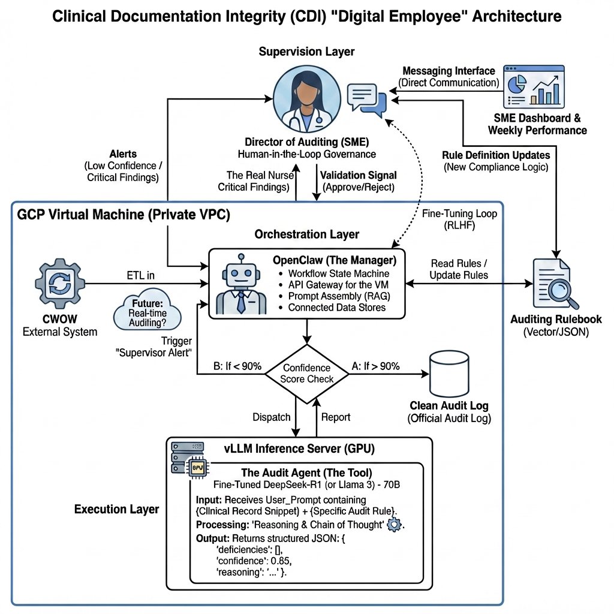

# Enterprise System Design: CDI Digital Auditor

**Status:** VISION (Not in Dev Lifecycle)
**Framework:** Open Source Agentic Architecture (OpenClaw + OpenCode)
**Deployment:** Private GCP VPC | GPU-Accelerated Local Inference

---

## Architecture Diagram



**Note:** Auditing Rulebook should be inside VPC boundary (proprietary business logic).

---

## 1. Architectural Overview

The CDI Digital Auditor is designed as a modular "Digital Employee." It separates the management of workflows from the high-security execution of clinical auditing rules. This ensures that sensitive patient data and proprietary business logic remain entirely within the enterprise's controlled environment.

---

## 2. Core Components

### 2.1. Orchestration Layer (The Manager)
| Attribute | Value |
|-----------|-------|
| Platform | OpenClaw |
| Management Model | Gemini (Enterprise) |

**Responsibility:**
- **Data Ingestion:** Managing ETL processes from BigQuery (TDR/CWOW)
- **Workflow State:** Tracking the progress of the 140-rule audit cycle
- **SME Interface:** Providing the dashboard for the Director of Auditing to review low-confidence findings

### 2.2. Audit Agent Layer (The Specialist)
| Attribute | Value |
|-----------|-------|
| Platform | OpenCode (Open Source) |
| Inference Engine | vLLM hosted on a GPU-enabled GCP VM |
| Local Model | Fine-tuned private reasoning models (e.g., DeepSeek-R1, Llama 3) |

**Responsibility:**
- **Rule Application:** Executing the 140 Medications Rules against raw data
- **Chain of Thought (CoT):** Generating detailed reasoning for every "Pass/Fail" audit result
- **Data Privacy:** Ensuring all "Reasoning" happens locally so that raw clinical data never traverses external APIs

---

## 3. Functional Workflow

| Stage | Action | Component |
|-------|--------|-----------|
| 1. Retrieve | Pulls Medication/Encounter records from BigQuery | OpenClaw |
| 2. Delegate | Hands off a specific data snippet and rule set to the Agent | OpenClaw → OpenCode |
| 3. Reason | Applies Chain of Thought to verify rule compliance locally | OpenCode (via Local GPU) |
| 4. Validate | Checks Confidence Score; if <90%, flags for SME review | OpenClaw |
| 5. Learn | Uses SME feedback to Fine-Tune the local model | GPU VM (Training Loop) |

---

## 4. Why VM Architecture vs. Cloud Run?

| Factor | VM + OpenClaw | Cloud Run (API-based) |
|--------|---------------|----------------------|
| **Data Sovereignty** | ✅ All data stays in VPC | ⚠️ Data sent to external API |
| **HIPAA/PHI Compliance** | ✅ Full control | ⚠️ Depends on vendor BAA |
| **Fine-Tuning** | ✅ Train on audit data | ❌ Not possible |
| **Cost Model** | Fixed (GPU VM) | Variable (per API call) |
| **Ops Complexity** | ⚠️ Higher | ✅ Lower (serverless) |
| **Vendor Lock-in** | ✅ Open source | ⚠️ Tied to API provider |

**Key Decision:** Clinical Trial Data contains PHI → VM Architecture ensures PHI never leaves VPC.

---

## 5. Strategic Design Advantages

| Advantage | Description |
|-----------|-------------|
| **Total Data Sovereignty** | By utilizing the open-source OpenCode framework, the agent runs entirely on local models. This eliminates data leakage risks and meets stringent HIPAA/Clinical Trial compliance standards. |
| **Deterministic + Semantic Hybrid** | The system uses deterministic mapping for field-level checks while leveraging the local LLM's semantic capabilities to interpret complex clinical notes. |
| **Hardware Optimization** | The system is optimized for GPU-backed VMs, allowing for high-throughput auditing without the latency or costs of public cloud inference. |

---

## 6. Infrastructure Cost Estimate

### Recommended Starting Configuration

| Component | Specification | Monthly Cost |
|-----------|---------------|--------------|
| GPU | NVIDIA L4 (24GB VRAM) | ~$500/mo |
| Model | DeepSeek-R1-Distill-Llama-8B | Open Source |
| **Total** | | **~$500/mo** |

### Scaling Path

| Phase | Model | GPU | Cost | Use Case |
|-------|-------|-----|------|----------|
| **Start** | Llama-8B | L4 24GB | ~$500/mo | Deterministic rules |
| Scale | Qwen-14B | L4 24GB | ~$500/mo | Better reasoning |
| Enterprise | Qwen-32B | A100 40GB | ~$2,100/mo | Complex semantic rules |

*Based on GCP On-Demand pricing, 24/7 operation.*

---

## 7. Future Roadmap & Scaling

| Phase | Description |
|-------|-------------|
| **Fine-Tuning Integration** | Establishing a recurring pipeline where validated audit results are used to further refine the local model's accuracy in the Medicines Domain. |
| **Cross-Domain Expansion** | Rolling out the OpenClaw/OpenCode framework to audit non-medication domains (e.g., Patient Consent, Eligibility). |

---

## Relationship to Current Sprint Work

```
CURRENT (Iteration 1-2)          FUTURE (This Vision)
─────────────────────────        ─────────────────────
Rules: 140 deterministic    →    Rules + Semantic reasoning
Agent: Claude Code          →    OpenCode + Local LLM
Data: CWOW Team provided    →    Self-managed ETL pipeline
Infra: Basic GCP            →    GPU VPC + vLLM
```

**Bridge Items (Iteration 2 Backlog → This Vision):**
1. Formal Treatment Data query → Foundation for "Retrieve" stage
2. Connect Agent to ETL → Foundation for "Delegate" stage
3. Agent Autonomous enhancement → Stepping stone to "Reason" stage

---

## Navigation

- Previous: [09-lead-developer.md](09-lead-developer.md)
- Next: [11-local-llm-deployment.md](11-local-llm-deployment.md) → [12-gpu-vm-provisioning.md](12-gpu-vm-provisioning.md)
- Start: [01-overview.md](01-overview.md)
